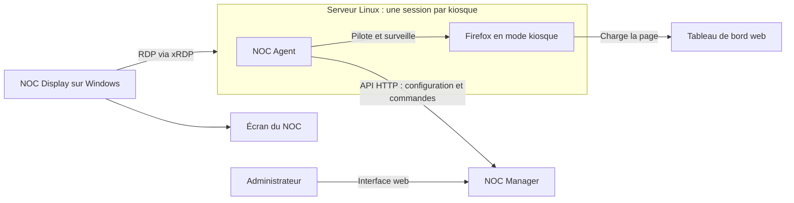

# NOC — Norfair Operation Center

NOC est une suite de trois applications pour administrer des écrans de tableaux
de bord : un serveur de configuration, un agent qui pilote Firefox dans une
session Linux, et un client Windows qui affiche cette session par RDP.

[Télécharger une version](https://github.com/nicolasfvrx/NOC-Software/releases) ·
[Compiler les applications](doc/README.md) ·
[Pousser le code et publier une release](doc/push-release.md)

## Les trois applications

| Application | Où elle tourne | Rôle |
| --- | --- | --- |
| **NOC Manager** | Serveur Windows | Interface web et API pour configurer les kiosques et envoyer les commandes de redémarrage. |
| **NOC Agent** | Chaque session Linux XFCE/xRDP | Récupère sa configuration, pilote Firefox et affiche les messages d’attente ou d’erreur. |
| **NOC Display** | Session Windows dédiée à un écran | Affiche la session Linux via un client RDP intégré, avec écran de connexion et reconnexion automatique. |



## Fonctionnement

1. Dans **NOC Manager**, l’administrateur crée un kiosque associé à un nom
   d’utilisateur Linux, puis choisit son URL, son activation et éventuellement
   une planification de redémarrage du navigateur.
2. **NOC Display** ouvre une connexion RDP vers le serveur Linux avec le compte
   configuré pour cet écran. Les paramètres RDP sont propres à chaque compte Windows.
3. Dans cette session Linux, **NOC Agent** identifie l’utilisateur courant et
   consulte `/api/kiosk/{username}` sur Manager. Il vérifie l’accessibilité de la
   destination avant de lancer Firefox Flatpak via geckodriver/WebDriver.
4. Pendant la connexion, le chargement ou une erreur, les applications présentent
   un écran de statut NOC. L’agent masque son écran de statut lorsque la page est
   prête, pour laisser apparaître Firefox.
5. L’agent relit régulièrement la configuration et les commandes. Il réagit aux
   changements d’URL, à la désactivation, aux redémarrages planifiés et à l’arrêt
   de Firefox. Display gère séparément les coupures et reconnexions RDP.

Manager définit **ce qu’affiche le navigateur**. Par défaut, Display utilise
sa propre configuration locale pour **la connexion RDP** — il peut aussi la
recevoir de Manager (`manager.provides_rdp`), auquel cas le compte Windows du
poste doit porter le même nom que le kiosque correspondant dans Manager.
Plusieurs comptes kiosques peuvent partager les mêmes machines et les mêmes
exécutables, avec une configuration d’affichage par utilisateur.

### Commandes distantes

- `restart_browser` : l’agent remet son écran de statut au premier plan, ferme
  Firefox et recharge la page.
- `restart_agent` : l’agent ferme le navigateur puis se relance lui-même
  (même PID), sans dépendre de systemd ni de l’autostart.

La planification `restart_cron` redémarre uniquement Firefox. L’agent conserve
l’identifiant de la dernière commande traitée pour éviter de la rejouer.
Si Manager devient indisponible alors que Firefox fonctionne, l’agent conserve
l’affichage en cours et réessaie de joindre le serveur.

### Supervision

Agent et Display affichent chacun leur version et leur date de build à l’écran,
et envoient un heartbeat périodique à Manager (désactivé par défaut côté Display).
Manager les expose en `/metrics` au format Prometheus, consommable depuis Grafana,
et les résume dans son interface web. Voir le
[README de NOC Manager](noc-manager/README.md#supervision-prometheus--grafana).

Manager peut aussi centraliser la **connexion RDP** de Display (serveur, port,
mot de passe, certificat), kiosque par kiosque — voir
[RDP centralisée](noc-manager/README.md#rdp-centralisée-noc-display).

## Installer et configurer

Télécharger l’archive correspondant à la machine dans les
[releases GitHub](https://github.com/nicolasfvrx/NOC-Software/releases).

| Application | Configuration | Guide détaillé |
| --- | --- | --- |
| Manager | `config.toml` dans son dossier de travail ; données dans `kiosks.json` et `commands.json`. | [NOC Manager](noc-manager/README.md) |
| Agent | `~/.config/noc-agent/config.toml` ; URL de Manager et chemins des images/wrapper Firefox. | [NOC Agent](noc-agent/README.md) |
| Display | `%USERPROFILE%/config.toml` pour chaque compte Windows ; serveur, compte et identifiants RDP. Images à côté de l’EXE. | [NOC Display](noc-display/README.md) |

Commencer par Manager, configurer les comptes kiosques, installer l’agent dans
chaque session Linux, puis configurer Display pour ouvrir ces sessions.
L’agent utilise **Firefox Flatpak**, **geckodriver** et une session graphique.
Choisir son service systemd utilisateur ou l’autostart ; ne pas activer les deux.

Le chemin historique `.display-client` reste utilisé pour préserver les
identifiants DPAPI déjà provisionnés. Côté Agent, les chemins ont été renommés
de `kiosk-agent` vers `noc-agent` (aucun repli automatique) : migrer à la main
la configuration, le profil Firefox et l'état d'une installation existante —
voir le [README de NOC Agent](noc-agent/README.md).

## Plateformes et builds

Un mécanisme de [mise à jour automatique au démarrage](doc/updates.md) existe
dans le dépôt mais est **désactivé pour le moment** : conçu pour un binaire par
instance, il ne convient pas tel quel à un binaire partagé par plusieurs
sessions. Installer chaque version manuellement en attendant sa refonte.

| Application | Exécutable | Cibles de la CI |
| --- | --- | --- |
| NOC Manager | `noc-manager.exe` | Windows Server 2012 et 2016 x64 |
| NOC Display | `noc-display.exe` | Windows Server 2012 et 2016 x64 avec bureau graphique |
| NOC Agent | `noc-agent` | Ubuntu 22.04 / Zorin OS 17 et Ubuntu 24.04 / Zorin OS 18 x64 |

Les builds Windows utilisent Rust **1.77.2** et le runtime MSVC statique. Les
builds Linux sont réalisés sur les deux bases Ubuntu. Les essais graphiques et
RDP sur les systèmes cibles restent nécessaires ; la CI compile et réalise des
contrôles de paquet, elle ne simule pas une installation complète du NOC.

- [Build Windows et création des archives](doc/windows.md)
- [Build Linux et installation](doc/linux.md)
- [GitHub Actions et publication automatique](doc/github-actions.md)
- [Commandes Git : premier push, mises à jour, tags](doc/push-release.md)

Les builds ne se déclenchent que sur un push de tag tel que **`v0.1.0`**, ou
manuellement via `workflow_dispatch`. Un tag stable déclenche aussi la création
de la release après réussite des six builds, avec quatre archives d'installation
Windows, deux archives Linux et quatre exécutables bruts pour la mise à jour
automatique. Un suffixe comme `v0.2.0-rc.1` crée une préversion.

Le tag représente la version de la **suite NOC**. Les versions internes restent
indépendantes : Manager **0.1.0**, Display **0.1.0**, Agent **1.0.0** pour cette
première livraison de la suite. Elles figurent dans les `Cargo.toml` et dans les
métadonnées ou la commande `--version` des applications concernées.

## Périmètre actuel

- Usage prévu sur un réseau local maîtrisé. L’interface web Manager n’a pas de
  comptes administrateurs et le serveur ne reçoit pas d’état de santé des agents.
- Manager propose un token API optionnel, mais le client Rust NOC Agent actuel
  n’envoie pas d’en-tête Bearer : cette association nécessite un token Manager vide.
- L’agent sait attendre un sélecteur CSS `ready_selector`, mais Manager ne permet
  pas encore de définir ni de renvoyer ce champ ; la détection standard de fin
  de chargement est utilisée avec le Manager actuel.
- Le script `noc-manager/kiosk.sh` est un client Linux simplifié fourni avec
  Manager. Le composant de la suite avec écran de statut est **NOC Agent**.

## Organisation du dépôt

```text
.github/workflows/   Builds et release GitHub
doc/                Guides de compilation et publication
scripts/            Scripts de build, packaging et publication
shared/             Mise à jour au démarrage partagée entre les applications
noc-manager/        Serveur d’administration Windows
noc-agent/          Agent graphique Linux
noc-display/        Client d’affichage RDP Windows
```
